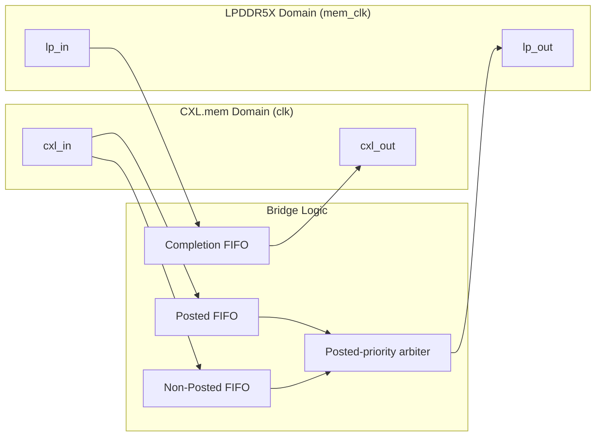

# CXL to LPDDR5X Bridge

[](https://github.com/markrthomas/cxl_lpddr5x_bridge/actions)

Experimental **Verilog / SystemVerilog** RTL for a bridge between a **CXL.mem**
host interface and an **LPDDR5X** DRAM command channel (a DFI-style command/response abstraction).

## Project Overview

The bridge accepts CXL.mem requests on the host clock domain, translates each into
a single LPDDR5X command flit, and crosses the two clock domains through **dual-clock
asynchronous FIFOs** with **per-class credit-based flow control**. Responses returning
from the memory side are CRC-checked and reconstructed into CXL completions.



## Key Features

- **Dual-Clock Domain**: Independent `clk` (CXL host) and `mem_clk` (LPDDR5X command channel); all crossings via Gray-coded async FIFOs and toggle synchronizers.
- **Protocol Translation**: CXL.mem `MEM_RD / MEM_WR / MEM_MRR / MEM_MRW` requests map to LPDDR5X `RD/RDA/WR/WRA/MWR/MRW/MRR` command flits; responses map back to CXL completions.
- **Credit Flow Control**: Hardware-enforced credits per traffic class — Posted, Non-Posted, Response — returned across domains by toggle-based pulse synchronizers.
- **Ordering Preservation**: Posted-priority arbitration with command lock so a selected command drains before re-arbitration.
- **Integrity Checking**: CRC-8/CCITT on the command channel; a response with a bad checksum (or unknown kind) becomes a CXL **INVALID** completion.
- **Link State Management**: A reset-drain FSM (`DOWN → UP → DRAIN → DOWN`) gates the bridge open only while the link is up and drains cleanly on link-down.
- **Robust Verification**: directed + stress (Icarus), 12 cocotb UVM-equivalent tests, SymbiYosys formal (BMC + cover), a Verilator coverage harness at **96.9%** line coverage, and concurrent **SVA** on all four valid/ready interfaces (runtime via Verilator `--assert` + proven in formal).

## Current Architecture

| Path | Source Domain | Destination Domain | Buffer | Flow Control |
|:---|:---|:---|:---|:---|
| CXL posted request (`MEM_WR`, `MEM_MRW`) | `clk` | `mem_clk` | `u_c2m_posted` async FIFO | `POSTED_CREDITS` |
| CXL non-posted request (`MEM_RD`, `MEM_MRR`) | `clk` | `mem_clk` | `u_c2m_np` async FIFO | `NP_CREDITS` |
| LPDDR5X response | `mem_clk` | `clk` | `u_m2c` async FIFO | `RSP_CREDITS` |

The top-level packet model is a fixed 64-bit simulation format shared in both directions:

| Bits | Field | Use |
|:---|:---|:---|
| `[63:60]` | Kind | CXL packet kind or LPDDR5X packet kind. |
| `[59:56]` | Code | Opcode / command sub-op / completion status. |
| `[55:48]` | Tag | Correlates requests and completions. |
| `[47:32]` | Address / byte count | 16-bit CXL byte address (`{BANK[15:12], ROW[11:0]}` downstream); byte count on completions. |
| `[31:24]` | Length | Burst length / column group. |
| `[23:16]` | ID | Requester / source / completer ID. |
| `[15:8]` | Attributes / lower address | Channel/rank attributes or completion lower address. |
| `[7:0]` | Misc / checksum | CRC-8/CCITT over header bytes `[63:8]`. |

## Module Map

| Module | Role |
|:---|:---|
| `src/cxl_lpddr5x_bridge.v` | Top-level translation, arbitration, credit, and link-gating integration. |
| `src/cxl_lpddr5x_bridge_defs.vh` | Packet constants, pack helpers, and CRC-8 checksum function. |
| `src/async_fifo.v` | Dual-clock first-word-fall-through FIFO with Gray-coded pointer CDC. |
| `src/cdc_sync.v` | Multi-flop level synchronizer for single-bit control crossings. |
| `src/reset_sync.v` | Asynchronous-assert / synchronous-deassert reset synchronizer. |
| `src/credit_counter.v` | Saturating per-class credit availability counter. |
| `src/credit_pulse_sync.v` | Toggle-based pulse crossing for credit returns. |
| `src/reset_drain.v` | `DOWN / UP / DRAIN` link-state gate. |
| `src/cxl_lpddr5x_bridge_chk.v` | Simulation checker wrapper used by directed tests. |

## Quick Start

All standard gates are exposed from the repo root (`make help` lists them):

```bash
make regress     # Verilator lint + Icarus directed simulation (fast gate)
make stress      # directed sim with heavy backpressure
make vcd         # directed sim, dump waveform -> verification/directed/build/waves.vcd
make gtkwave     # make vcd, then open it in GTKWave with a saved signal layout
make vlt-vcd     # Verilator --trace build of sim/sim_main.cpp -> sim/obj_dir_vcd/waves.vcd
make cocotb      # 12 cocotb OSS UVM-equivalent tests (Icarus VPI)
make formal      # SymbiYosys BMC + cover (credit_counter, reset_drain, bridge)
make coverage    # Verilator --coverage -> sim/coverage.info (96.9% lines)
make sva         # Verilator --assert: interface SVA on all 4 valid/ready ports
make ci          # regress + coverage + sva + formal + cocotb
```

Per-area Makefiles also run standalone, e.g. `make -C verification/directed stress`
or `make -C verification/formal cxl_lpddr5x_bridge`.

## Documentation

- **Design Specification**: [doc/design-spec.md](doc/design-spec.md) — architecture, opcode mapping, packet format, FSM, and verification.
- **Plan**: [doc/PLAN.md](doc/PLAN.md) — current state and phased roadmap.

Build a PDF of the spec with `make -C doc` (requires `pandoc` + a LaTeX engine).

## Status

The RTL implements granular protocol opcodes, posted-priority egress arbitration,
fully integrated cross-domain credit counters, and a reset-drain link gate. It is
verified for structural integrity and logical correctness across varied clock
ratios (1:1, 2:1, 1:3) and traffic patterns.

## Known Limits

| Area | Current Limit |
|:---|:---|
| Protocol compliance | The 64-bit packet format is a compact model, not a full CXL.mem or LPDDR5X wire encoding. |
| Payload data | Header/control fields are modeled; multi-beat payload transport is not implemented. |
| Memory model | The downstream side is a command/response abstraction; no bank/timing (tRCD/tRP/…) scheduler. |
| Link training | `link_up` is an external input consumed by the reset-drain FSM; PHY training is out of scope. |
| UVM | `verification/uvm/` is a placeholder for a VCS UVM bench; directed + cocotb tests are the executable regression baseline. |

---
*Experimental RTL — for educational and prototyping purposes.*
