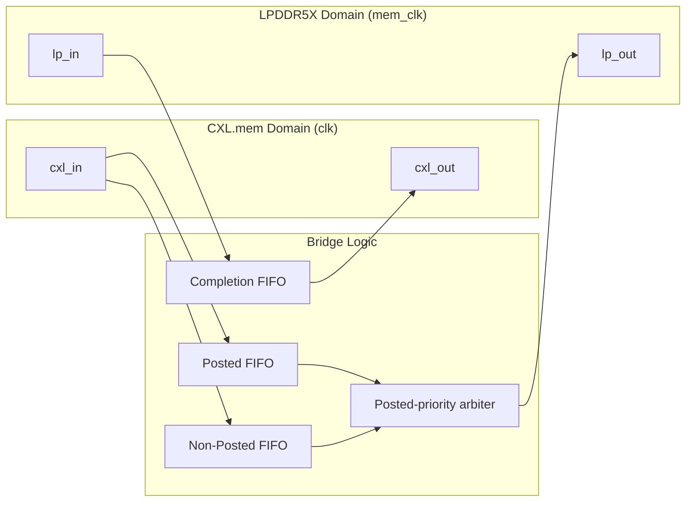

# CXL to LPDDR5X Bridge

[](https://github.com/markrthomas/cxl-to-lpddr5x-bridge/actions/workflows/ci.yml)

Experimental **Verilog / SystemVerilog** RTL for a bridge between a **CXL.mem**
host interface and an **LPDDR5X** DRAM command channel (a DFI-style command/response abstraction).

## Project Overview

The bridge accepts CXL.mem requests on the host clock domain, translates each into
a single LPDDR5X command flit, and crosses the two clock domains through **dual-clock
asynchronous FIFOs** with **per-class credit-based flow control**. Responses returning
from the memory side are CRC-checked and reconstructed into CXL completions.


```mermaid
graph LR
    subgraph CXL ["CXL.mem Domain (clk)"]
        direction TB
        CI[cxl_in]
        CO[cxl_out]
    end

    subgraph Bridge ["Bridge Logic"]
        direction TB
        F1[Posted FIFO]
        F2[Non-Posted FIFO]
        F3[Completion FIFO]
        AR[Posted-priority arbiter]
    end

    subgraph LP ["LPDDR5X Domain (mem_clk)"]
        direction TB
        LO[lp_out]
        LI[lp_in]
    end

    CI --> F1 & F2
    F1 & F2 --> AR --> LO
    LI --> F3
    F3 --> CO
```

## Key Features

- **Dual-Clock Domain**: Independent `clk` (CXL host) and `mem_clk` (LPDDR5X command channel); all crossings via Gray-coded async FIFOs and toggle synchronizers — structurally audited (`make cdc`) so no crossing bypasses a synchronizer.
- **Protocol Translation**: CXL.mem `MEM_RD / MEM_WR / MEM_MRR / MEM_MRW` requests map to LPDDR5X `RD/RDA/WR/WRA/MWR/MRW/MRR` command flits; responses map back to CXL completions.
- **Credit Flow Control**: Hardware-enforced credits per traffic class — Posted, Non-Posted, Response — derived from async-FIFO write-domain occupancy, so credit return across clock domains is inherently CDC-lossless (no toggle-pulse return path to drop).
- **Ordering Preservation**: Posted-priority arbitration with command lock so a selected command drains before re-arbitration.
- **Integrity Checking**: CRC-8/CCITT on the command channel; a response with a bad checksum (or unknown kind) becomes a CXL **INVALID** completion.
- **Link State Management**: A reset-drain FSM (`DOWN → UP → DRAIN → DOWN`) gates the bridge open only while the link is up and drains cleanly on link-down.
- **Robust Verification**: directed + stress (Icarus), 12 cocotb UVM-equivalent tests, SymbiYosys formal (BMC + cover, plus **unbounded `prove`** / k-induction on *all four* modules — `credit_counter`, `reset_drain`, the dual-clock `async_fifo`, and the `cxl_lpddr5x_bridge` top itself — the CDC Gray-pointer occupancy bound is proven for all time via ghost-counter invariants, the bridge top via shadow-register egress data-stability + an arbiter-lock invariant + assume-guarantee composition of the FIFO occupancy proof), a Verilator coverage harness at **100%** line coverage (gated, defensive lines waived), and concurrent **SVA** on all four valid/ready interfaces (runtime via Verilator `--assert` + proven in formal). A full **UVM** bench (`verification/uvm/`, scoreboard + functional coverage) targets commercial simulators (Cadence Xcelium).

## Current Architecture

| Path | Source Domain | Destination Domain | Buffer | Flow Control |
|:---|:---|:---|:---|:---|
| CXL posted request (`MEM_WR`, `MEM_MRW`) | `clk` | `mem_clk` | `u_c2m_posted` async FIFO | `POSTED_CREDITS` |
| CXL non-posted request (`MEM_RD`, `MEM_MRR`) | `clk` | `mem_clk` | `u_c2m_np` async FIFO | `NP_CREDITS` |
| LPDDR5X response | `mem_clk` | `clk` | `u_m2c` async FIFO | `RSP_CREDITS` |

The top-level packet model is a fixed 64-bit simulation format shared in both directions:

| Bits | Field | Use |
|:---|:---|:---|
| `[63:60]` | Kind | CXL packet kind or LPDDR5X packet kind. |
| `[59:56]` | Code | Opcode / command sub-op / completion status. |
| `[55:48]` | Tag | Correlates requests and completions. |
| `[47:32]` | Address / byte count | 16-bit CXL byte address (`{BANK[15:12], ROW[11:0]}` downstream); byte count on completions. |
| `[31:24]` | Length | Burst length / column group. |
| `[23:16]` | ID | Requester / source / completer ID. |
| `[15:8]` | Attributes / lower address | Channel/rank attributes or completion lower address. |
| `[7:0]` | Misc / checksum | CRC-8/CCITT over header bytes `[63:8]`. |

## Module Map

| Module | Role |
|:---|:---|
| `src/cxl_lpddr5x_bridge.v` | Top-level translation, arbitration, credit, and link-gating integration. |
| `src/cxl_lpddr5x_bridge_defs.vh` | Packet constants, pack helpers, and CRC-8 checksum function. |
| `src/async_fifo.v` | Dual-clock first-word-fall-through FIFO with Gray-coded pointer CDC; exposes write-domain occupancy used for credit gating. |
| `src/cdc_sync.v` | Multi-flop level synchronizer for single-bit control crossings. |
| `src/reset_sync.v` | Asynchronous-assert / synchronous-deassert reset synchronizer. |
| `src/credit_counter.v` | Saturating credit availability counter (standalone, formally verified; not in the occupancy-based datapath). |
| `src/credit_pulse_sync.v` | Toggle-based single-event pulse crossing (used for the CRC-error counter). |
| `src/reset_drain.v` | `DOWN / UP / DRAIN` link-state gate. |
| `src/cxl_lpddr5x_bridge_chk.v` | Simulation checker wrapper used by directed tests. |

## Quick Start

All standard gates are exposed from the repo root (`make help` lists them);
target names follow the cross-repo convention in
[`DV_STANDARDS.md`](DV_STANDARDS.md):

```bash
make check       # lint + sim (light local gate; run on every save)
make test        # alias for cocotb (DV_STANDARDS.md cross-repo name)
make regress     # Verilator lint + Icarus directed simulation (fast gate)
make stress      # directed sim with heavy backpressure
make vcd         # directed sim, dump waveform -> verification/directed/build/waves.vcd
make gtkwave     # default waveform view: randomized soak (make vlt-rand), opened in GTKWave
                 # with a saved signal layout; see below
make directed-gtkwave # make vcd, then open the directed-TB VCD in GTKWave with a saved layout
make vlt-vcd     # Verilator --trace build of sim/sim_main.cpp -> sim/obj_dir_vcd/waves.vcd
make vlt-rand    # randomized waveform-debug run (Verilator --trace --assert); see below
make cocotb      # 12 cocotb OSS UVM-equivalent tests (Icarus VPI)
make formal      # SymbiYosys BMC + cover + unbounded prove (credit_counter, reset_drain, async_fifo, and bridge top; depth 24)
make coverage    # Verilator --coverage -> sim/coverage.info (100%; fails below 80% floor)
make sva         # Verilator --assert: interface SVA on all 4 valid/ready ports
make synth       # Yosys synth gate: no latches + cell-count/logic-depth ceilings; emits gate-level netlist
make cdc         # Yosys structural CDC audit: every clock crossing must go through a synchronizer
make perf        # LPDDR5X bank/timing model: end-to-end latency + throughput (PERF_PATTERN=rand|stream|hotbank|mixed, PERF_SCHED=fcfs|frfcfs)
make perf-sweep  # characterize latency/throughput vs credit + FIFO-depth settings
make perf-selftest # unit-check the timing model's arithmetic (plain g++)
make verible-lint   # Verible SystemVerilog style-lint (advisory; .rules.verible_lint)
make verible-format # Verible auto-format the RTL in place (opt-in, local — reflows hand-alignment)
make ci          # regress + coverage + sva + formal + cocotb
```

Per-area Makefiles also run standalone, e.g. `make -C verification/directed stress`
or `make -C verification/formal cxl_lpddr5x_bridge`.

A full **UVM** testbench lives in `verification/uvm/` for use with commercial
simulators (Cadence Xcelium): `make uvm` (or `make -C verification/uvm
[smoke|random|err_inj]`; no test specified defaults to `random`, the randomized
soak). It is intentionally **not** part of the OSS CI gate and no-ops when
`xrun` is absent — see [verification/uvm/README.md](verification/uvm/README.md).

### Waveform debugging

`make gtkwave` is the default, no-argument waveform view — it's `make
vlt-rand-gtkwave` under the hood: a randomized Verilator run
(`sim/sim_rand.cpp`) opened in GTKWave with a saved signal layout
(`sim/cxl_lpddr5x_bridge_rand.gtkw`), grouping clocks/reset/link control and
the four valid/ready ports plus status counters. It drives randomized,
protocol-legal traffic — random opcode mix, valid gaps, sink backpressure on
both egress ports, link-down drain windows, and error-injection pulses — and
dumps a short, navigable VCD (comfortably more than 5 transactions per run).
It runs under Verilator `--trace --assert`, so the interface SVA is live and a
protocol violation aborts with the VCD intact. Runs are reproducible and print
cycle-stamped event markers (sustained backpressure, link up/down, `drain_done`,
error pulses) so you can jump straight to the interesting region:

```bash
make gtkwave                                  # default: randomized soak + saved layout
make vlt-rand RAND_SEED=42 RAND_CYCLES=4000   # the seed is printed and replayable
make vlt-rand-gtkwave RAND_SEED=42            # same, then open in GTKWave
make directed-gtkwave                         # Icarus directed TB (scoreboard, clock-ratio sweeps) + saved layout
```

## Performance characterization

`make perf` attaches a behavioral **LPDDR5X bank/timing scheduler model**
(`sim/lpddr5x_timing_model.h`) as the memory side of the bridge. Every command
the bridge emits on `lp_out` is decoded and served by the model, which returns
the matching `lp_in` response after a latency derived from bank state and a
JEDEC-style timing set — closing a realistic end-to-end loop so the harness
(`sim/sim_perf.cpp`) can measure latency and throughput. The model covers 16
banks in 4 bank groups (row hit / miss / empty; tRCD, tRP, tRAS, tRC, tCCD_L/S,
tRRD_L/S, tFAW, tRL/tWL, tWR, tRTP) and a **finite controller command queue** that
backpressures `lp_out_ready`, so an offered load above the memory's sustainable
rate backs up through the bridge credits instead of producing an unbounded
schedule. It is a *characterization* model, not a sign-off memory model, and
scores no functional correctness (directed / cocotb / formal own that).

By default it schedules **in-order (FCFS)**. An opt-in queued scheduler
(`PERF_SCHED=frfcfs`) adds **FR-FCFS** row-hit reordering — a younger column
command to an already-open row is promoted ahead of older commands that would pay
an activate/precharge — and, with `PERF_WBUF=1`, a **read-priority write buffer**
that drains writes in bursts so reads jump the queue. FCFS and FR-FCFS share one
identical command-queue/backpressure model, so the policy A/B isolates the pure
reordering effect.

```bash
make perf PERF_PATTERN=stream           # high locality + bank parallelism
make perf PERF_PATTERN=rand             # mostly row-miss, spread across banks
make perf PERF_PATTERN=hotbank          # few banks -> bank-cycle contention
make perf PERF_PATTERN=mixed            # hits + misses interleaved (reorder-friendly)
make perf PERF_PATTERN=mixed PERF_SCHED=frfcfs PERF_WBUF=1   # FR-FCFS + write buffer
make perf PERF_LOAD=60 PERF_SEED=3      # offered load / seed knobs
make perf-sweep                         # latency/throughput knee + scheduler A/B
```

`make perf` prints the row hit/miss mix, command/completion throughput, and
end-to-end latency percentiles (min/mean/p50/p95/p99/max, host clk cycles).
Address locality dominates: `stream` (bank-interleaved, high row-hit rate)
sustains roughly **2× the throughput and the lowest latency**, while `hotbank`
(constant row conflicts on a few banks) is the worst. `make perf-sweep`
re-elaborates the DUT across credit + FIFO-depth points and A/Bs the scheduler at
each: throughput is **memory-bound** — flat across the credit range, set by
locality — while end-to-end latency grows steadily, so credits beyond the small
pool needed to cover the round-trip are pure latency cost (Little's law):

```
pattern    cred sched        hit%  cmd/cyc  cpl/cyc  e2e_mean   e2e_p95   reord
stream        8 fcfs         61.9    0.161    0.112     443.7       632       0
rand          8 fcfs          0.0    0.078    0.053     760.5      1049       0
rand          8 frfcfs        0.0    0.078    0.053     760.5      1049       0
hotbank       8 fcfs          9.1    0.049    0.033    1124.9      1501       0
hotbank       8 frfcfs       26.8    0.059    0.039     963.5      1381     129
mixed         8 fcfs         47.4    0.125    0.087     528.1       748       0
mixed         8 frfcfs       47.8    0.133    0.092     505.2       775     538
mixed         8 frfcfs-wb    47.7    0.140    0.097     487.4       796     530
```

On the reorder-friendly patterns FR-FCFS earns its keep: on `mixed` it raises
command throughput and lowers mean latency at a modestly worse tail (the classic
DRAM-controller trade-off), and on `hotbank` it nearly triples the row-hit rate
(9%→27%) by finding the scarce hits among the contended banks; the write buffer
adds a further throughput bump. On 0%-hit `rand`, FCFS and FR-FCFS are byte-for-byte
identical (nothing to promote) — so the A/B is honest, not a stacked deck.

`make perf-selftest` is a deterministic g++ unit test that pins the model's timing
arithmetic (row-hit latency = tRL + tBURST, a miss adds tRP + tRCD, writes use tWL,
mode-register access = tMRR) and the scheduler behavior (row-hit promotion under
FR-FCFS but not FCFS; the write buffer's read-priority and drain hysteresis).

## Continuous Integration

`.github/workflows/ci.yml` runs a fast `regress` gate (lint + directed sim +
stress), then fans out to parallel jobs that each depend on it:

| Job | Command | Notes |
|:---|:---|:---|
| `regress` | `make regress && make stress` | Verilator lint + Icarus directed/stress |
| `coverage` | `make coverage` | enforces 80% line floor; uploads `coverage.info` |
| `sva` | `make sva` | interface SVA under Verilator `--assert` |
| `random` | `make vlt-rand RAND_SEED=<n>` | seed matrix `[1..4]`; per-seed VCD artifact |
| `cocotb` | `make cocotb` | 12 cocotb tests |
| `formal` | `make formal` | SymbiYosys (pinned OSS CAD Suite); BMC + cover + unbounded `prove` |
| `synth` | `make synth` + `make cdc` | Yosys synth gate (no latches, cell-count + logic-depth ceilings; uploads netlist) **and** structural CDC audit |
| `docs` | `make doc` | builds the design-spec PDF (pandoc + LaTeX); uploads `design-spec.pdf` artifact |
| `verible` | `make verible-lint` | **advisory** SystemVerilog style-lint (`continue-on-error`, never gates) |

The UVM bench is **not** in CI (it needs a commercial simulator license).

### Pinned tool versions

Reproducible-build tools are version-pinned (bump in `.github/workflows/ci.yml`):

| Tool | Version | Pinned in |
|:---|:---|:---|
| OSS CAD Suite (Yosys / SymbiYosys) | `2026-04-13` | `env.OSS_CAD_SUITE_VERSION` |
| Verible (style-lint / format) | `v0.0-3946-g851d3ff4` | `env.VERIBLE_VERSION` |
| cocotb | `1.8.1` | `cocotb` job (`pip install`) |
| Verilator / Icarus Verilog | distro `apt` (ubuntu-latest) | `regress` job |

## Documentation

- **Design Specification**: [doc/design-spec.md](doc/design-spec.md) — architecture, opcode mapping, packet format, FSM, and the full verification/CI stack.
- **Plan**: [doc/PLAN.md](doc/PLAN.md) — current state and phased roadmap.
- **UVM bench**: [verification/uvm/README.md](verification/uvm/README.md) — UVM env structure, how to run with Xcelium, and porting notes.

Build a PDF of the spec with `make doc` (pandoc + a LaTeX engine; auto-detects
`pdflatex`/`xelatex` and skips cleanly if absent). CI builds it and publishes
`design-spec.pdf` as an artifact.

## Status

The RTL implements granular protocol opcodes, posted-priority egress arbitration,
occupancy-based cross-domain credit flow control, and a reset-drain link gate. It is
verified for structural integrity and logical correctness across varied clock
ratios (1:1, 2:1, 1:3) and traffic patterns.

## Known Limits

| Area | Current Limit |
|:---|:---|
| Protocol compliance | The 64-bit packet format is a compact model, not a full CXL.mem or LPDDR5X wire encoding. |
| Payload data | Header/control fields are modeled; multi-beat payload transport is not implemented. |
| Memory model | The bridge datapath treats the downstream side as a command/response abstraction (no bank/timing scheduler in RTL). An LPDDR5X bank/timing model exists as a **sim-only** perf-characterization harness (`make perf`), not part of the datapath. |
| Link training | `link_up` is an external input consumed by the reset-drain FSM; PHY training is out of scope. |
| UVM | A full UVM bench is present (`verification/uvm/`) but targets a commercial simulator (Xcelium) and is excluded from OSS CI; the OSS executable regression is directed + cocotb + randomized (`vlt-rand`) + formal. |

---
*Experimental RTL — for educational and prototyping purposes.*
